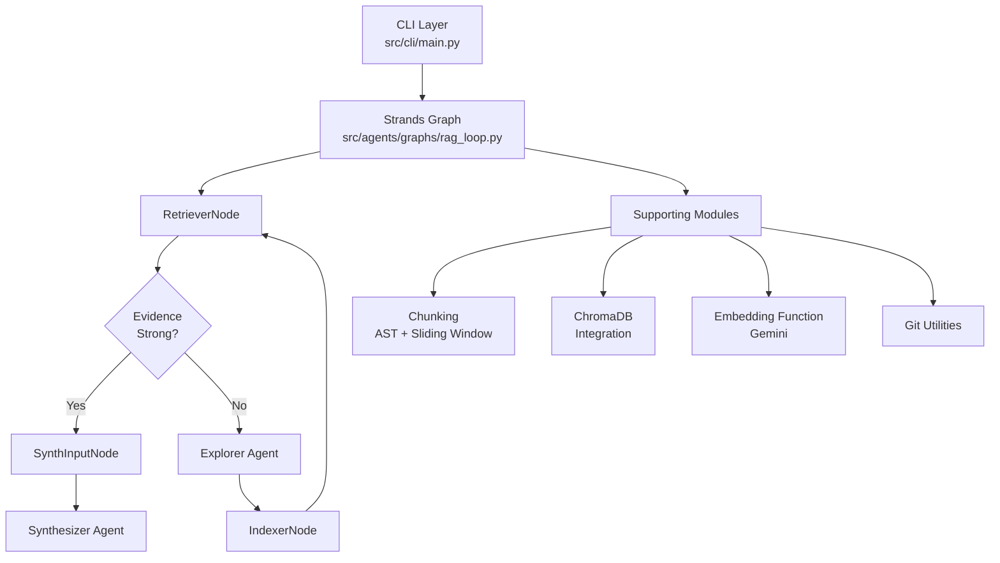
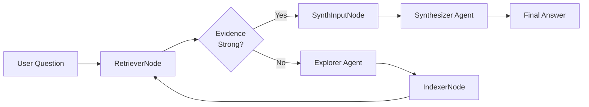
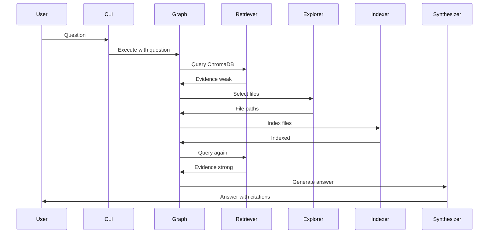
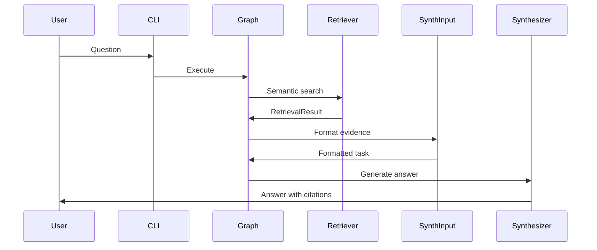

# System Architecture

## Overview

ASKII is a RAG (Retrieval-Augmented Generation) system that enables natural language queries over codebases. It runs as a **Strands graph** with a **targeted indexing loop**: retrieve evidence from ChromaDB, and if evidence is weak, use an Explorer agent to select relevant files to index, then retry retrieval.

## High-Level Architecture

## Agent Flow

### Graph Loop (Targeted Indexing)

The system uses a cyclic workflow:

### Agent Responsibilities

#### Explorer Agent
- **Input**: Question (+ optional already-indexed file list)
- **Output**: `files: list[str]` (absolute paths)
- **Responsibilities**:
  - Use `rg` (via the Strands shell tool) to find relevant files
  - Return a small list of absolute file paths for targeted indexing
- **Location**: `src/agents/factories/explorer.py`

#### RetrieverNode
- **Input**: ChromaDB collection, question
- **Output**: `RetrievalResult` + approval decision (continue loop vs synthesize)
- **Responsibilities**:
  - Query ChromaDB with semantic similarity search
  - Compute evidence strength (max similarity) and gate the loop
- **Location**: `src/agents/nodes/retriever.py`

#### IndexerNode
- **Input**: Explorer-selected absolute file paths
- **Output**: Updated collection (side effect) + indexing stats
- **Responsibilities**:
  - Ensure selected files are within the repository root
  - Chunk selected files and upsert them into ChromaDB
- **Location**: `src/agents/nodes/indexer.py`

#### SynthInputNode
- **Input**: `RetrievalResult`
- **Output**: Deterministic Synthesizer task string
- **Responsibilities**:
  - Format retrieved snippets with `[file:start-end]` citation guidance
- **Location**: `src/agents/nodes/synth_input.py`

#### Synthesizer Agent
- **Input**: Synth task (question + snippets)
- **Output**: Answer text with inline citations
- **Responsibilities**:
  - Answer using only provided snippets
  - Include inline citations for every code claim
- **Location**: `src/agents/factories/synthesizer.py`

## Component Descriptions

### Chunking Module (`src/chunking/`)

**Purpose**: Split files into semantically meaningful chunks

**Strategies**:
1. **AST-Based Chunking** (Python files):
   - Uses Python's `ast` module to extract functions and classes
   - Preserves precise line ranges (`lineno`, `end_lineno`)
   - Handles nested functions/classes
   - Validates token count (300-token limit)
   - Falls back to sliding window for large functions/classes
   - **Location**: `src/chunking/ast_chunker.py`

2. **Sliding Window Chunking** (Other files):
   - 300-token chunks with 20% overlap (60 tokens)
   - Uses tiktoken for tokenization
   - Estimates line ranges based on character positions
   - Handles edge cases (empty files, small files)
   - **Location**: `src/chunking/sliding_window.py`

**Key Functions**:
- `chunk_file_from_path()`: Main entry point, routes to appropriate chunker
- `chunk_python_file()`: AST-based chunking
- `chunk_text_file()`: Sliding window chunking
- `count_tokens()`: Token counting with tiktoken

### DB Module (`src/db/`)

**Purpose**: ChromaDB integration (persistent client/collections)

**Components**:
1. **ChromaDB Client** (`src/db/chroma.py`):
   - Persistent client pointing to `.data/chroma/`
   - Collections are created/get in the CLI and passed through the graph state
   - Singleton pattern for client instance

### Agents Module (`src/agents/`)

**Purpose**: Strands graph orchestration (graph builders, deterministic nodes, and agent factories)

**Components**:
1. **Graphs** (`src/agents/graphs/`):
   - Builds the top-level loop graph (`rag_loop.py`)
   - Defines node connections and conditional edges
   - Sets execution limits and timeouts

2. **Nodes** (`src/agents/nodes/`):
   - Deterministic nodes for retrieval gating, indexing, and formatting synthesizer input
   - All nodes extend `MultiAgentBase` from Strands

3. **Factories** (`src/agents/factories/`):
   - Creates configured Strands Agents (Explorer, Synthesizer)
   - Encapsulates model configuration, system prompts, and tools

### Utilities Module (`src/utils/`)

**Purpose**: Shared utilities across components

**Components**:
1. **Git Utilities** (`git_utils.py`):
   - Repository detection
   - Repository name extraction
   - Commit hash retrieval
   - Collection name generation
   - Singleton pattern for GitRepo instances

2. **CLI Progress** (`src/cli/progress.py`):
   - Spinner UI for graph execution
   - Node action display

## Data Flow

### Targeted Indexing Loop

### Query Flow

## Design Decisions

### Why Agentic Architecture?

1. **Separation of Concerns**: Each agent has a single, well-defined responsibility
2. **Modularity**: Agents can be tested and developed independently
3. **Extensibility**: Easy to add new agents or modify existing ones
4. **Error Handling**: Each agent can handle errors appropriately for its domain

### Why strands-agents?

1. **Lightweight**: Simple API without unnecessary complexity
2. **Gemini Support**: Native support for Gemini models
3. **Flexibility**: Can use different models per agent
4. **Future-Proof**: Easy to add tools or enhance agents

### Why ChromaDB?

1. **Persistent Storage**: Data persists across sessions
2. **Custom Embeddings**: Supports custom embedding functions
3. **Local Deployment**: No cloud dependencies
4. **Simple API**: Easy to integrate and use

### Why Hybrid Chunking?

1. **Python-Specific**: AST chunking preserves semantic structure
2. **Precise Citations**: Exact line ranges for Python code
3. **Fallback**: Sliding window for other languages and large functions
4. **Token Limits**: Enforces 300-token limit consistently

### Why Gemini Models?

1. **Code Performance**: gemini-embedding-001 performs well on code
2. **Consistency**: Single provider for embeddings and LLM
3. **Cost-Effective**: Competitive pricing
4. **API Quality**: Good documentation and reliability

## Error Handling Strategy

### Error Categories

1. **Input Validation**: Fail fast with clear messages
2. **Agent Errors**: Structured error states propagated through the graph execution
3. **External API Errors**: Retry logic where appropriate, user-friendly messages
4. **File Errors**: Graceful degradation (skip bad files, continue processing)

### Error Message Principles

1. **Plain English**: No technical jargon
2. **Actionable**: Specific steps to resolve
3. **Specific**: Different messages for different error types
4. **Contextual**: Include relevant details (file paths, operation names)

## Performance Considerations

### Indexing

- **Batching**: Embeddings generated in batches (100 items)
- **Targeted indexing**: The graph indexes only Explorer-selected files when evidence is weak

### Query

- **Top-K Limiting**: Default 10 chunks balances relevance and speed
- **Deduplication**: Reduces redundant processing

## Security Considerations

1. **Read-Only**: Tool never modifies repositories
2. **API Keys**: Stored in environment variables, not in code
3. **Local Storage**: All data stored locally in `.data/` directory
4. **Path Validation**: Validates all file paths before access

## Future Enhancements

1. **Multi-Repository Queries**: Query across multiple repositories
2. **Interactive Mode**: REPL for iterative queries
3. **Query History**: Track and replay previous queries
4. **Advanced Post-Processing**: Reranking, filtering by file type
