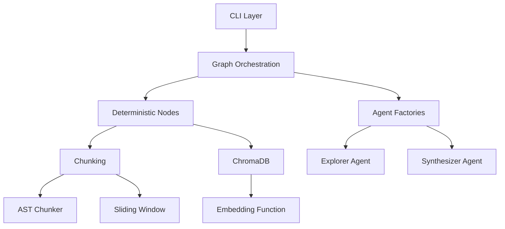
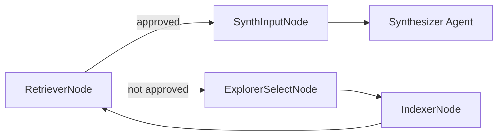
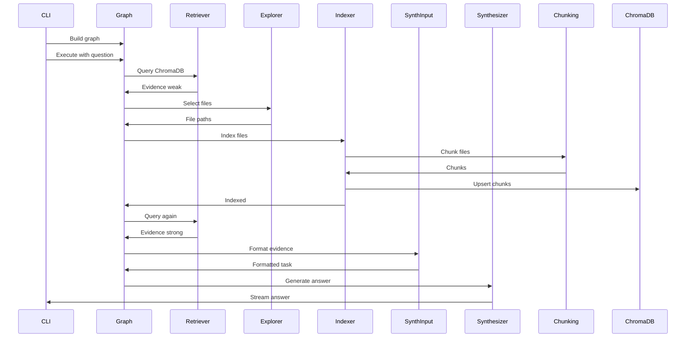

# Components

## Overview

This document describes the major components of the ASKII system, their responsibilities, and how they interact.

## Component Hierarchy

## Core Components

### CLI Layer

**Location**: `src/cli/main.py`

**Responsibilities**:
- Parse command-line arguments
- Validate repository path
- Initialize ChromaDB collection
- Build and execute Strands graph
- Handle streaming output from Synthesizer
- Display progress indicators

**Key Functions**:
- `parse_args()`: Parse CLI arguments
- `main()`: Main entry point
- `_run_graph_with_streaming()`: Execute graph with streaming output

**Dependencies**:
- `argparse`: Command-line parsing
- `asyncio`: Async graph execution
- `chromadb`: Collection management
- `src.agents.graphs`: Graph building
- `src.utils.git_utils`: Repository information

### Graph Orchestration

**Location**: `src/agents/graphs/rag_loop.py`

**Responsibilities**:
- Build the RAG loop graph structure
- Define node connections and conditional edges
- Set execution limits and timeouts
- Provide node action mappings for UI

**Key Functions**:
- `build_rag_loop_graph()`: Build the primary graph
- `get_node_actions()`: Get human-friendly action labels
- `_approved_from_graph_state()`: Read approval decision from state

**Graph Structure**:

### Deterministic Nodes

#### RetrieverNode

**Location**: `src/agents/nodes/retriever.py`

**Responsibilities**:
- Query ChromaDB with semantic similarity search
- Post-process results (deduplication, similarity calculation)
- Gate the loop based on evidence strength
- Track attempt count

**Key Functions**:
- `invoke_async()`: Execute retrieval and gating logic
- `_retrieve_chunks()`: Query ChromaDB and format results
- `_deduplicate_chunks()`: Remove overlapping chunks
- `_distance_to_similarity()`: Convert distance to similarity score

**Thresholds**:
- `STRONG_THRESHOLD`: 0.7 (similarity threshold for strong evidence)
- `SIMILARITY_THRESHOLD`: 0.7 (minimum similarity for chunks)
- `MAX_ATTEMPTS`: 3 (maximum loop iterations)

#### IndexerNode

**Location**: `src/agents/nodes/indexer.py`

**Responsibilities**:
- Validate file paths (ensure within repository)
- Chunk selected files
- Upsert chunks into ChromaDB
- Track already-indexed files
- Handle errors gracefully (best-effort indexing)

**Key Functions**:
- `invoke_async()`: Execute indexing logic
- `_run_indexing()`: Index a list of file paths
- `_add_chunks_to_collection()`: Upsert chunks to ChromaDB
- `_delete_chunks_by_file_path()`: Delete old chunks before re-indexing
- `_extract_files_abs()`: Extract file paths from Explorer output

**Data Structures**:
- `IndexingRun`: Dataclass for indexing statistics

#### ExplorerSelectNode

**Location**: `src/agents/nodes/explorer_select.py`

**Responsibilities**:
- Invoke Explorer agent
- Extract structured output (file paths)
- Store paths in invocation state
- Suppress tool output (keep CLI clean)

**Key Functions**:
- `invoke_async()`: Execute Explorer and extract files
- `_extract_files_abs()`: Extract file paths from AgentResult
- `_agent_result()`: Create AgentResult for downstream nodes

#### SynthInputNode

**Location**: `src/agents/nodes/synth_input.py`

**Responsibilities**:
- Format retrieval evidence into Synthesizer task
- Include question and retrieved snippets
- Add citation guidance
- Handle empty evidence case

**Key Functions**:
- `invoke_async()`: Format and store synthesizer task
- `_format_task()`: Build formatted task string
- `_agent_result()`: Create AgentResult for Synthesizer

### Agent Factories

#### Base Factory

**Location**: `src/agents/factories/base.py`

**Responsibilities**:
- Abstract base class for agent factories
- Template methods for agent configuration
- Tool consent bypass for CLI usage

**Key Methods**:
- `create()`: Create configured Strands Agent
- `_system_prompt()`: Abstract method for system prompt
- `_model()`: Abstract method for model configuration
- `_name()`: Abstract method for agent name
- `_tools()`: Optional method for tools
- `_structured_output_model()`: Optional method for structured output

#### Explorer Factory

**Location**: `src/agents/factories/explorer.py`

**Responsibilities**:
- Create Explorer agent with shell tool access
- Configure system prompt for file selection
- Set up structured output (FilesResponse)

**Configuration**:
- Model: `gemini-2.5-flash`
- Temperature: 0.1 (low for deterministic file selection)
- Tools: `shell` (for ripgrep access)
- Structured Output: `FilesResponse` (list of absolute paths)

**System Prompt Features**:
- Repository root context
- Rules against file modification
- Instructions for using `rg` (ripgrep)
- Absolute path requirements

#### Synthesizer Factory

**Location**: `src/agents/factories/synthesizer.py`

**Responsibilities**:
- Create Synthesizer agent for answer generation
- Configure system prompt for citation requirements
- Set output token limits

**Configuration**:
- Model: `gemini-2.5-flash`
- Temperature: 0.7 (balanced for creative but grounded answers)
- Max Output Tokens: 8192 (configurable via `SYNTHESIZER_MAX_OUTPUT_TOKENS`)

**System Prompt Features**:
- Plain text output requirement
- Citation format: `[file.py:start-end]`
- Evidence handling (strong/weak/none)
- No speculation rule

### Chunking Module

#### Chunker Router

**Location**: `src/chunking/chunker.py`

**Responsibilities**:
- Route files to appropriate chunking strategy
- Handle file reading from disk
- Provide unified interface

**Key Functions**:
- `chunk_file()`: Route to AST or sliding window
- `chunk_file_from_path()`: Read file and chunk

#### AST Chunker

**Location**: `src/chunking/ast_chunker.py`

**Responsibilities**:
- Parse Python files using AST
- Extract functions and classes
- Preserve precise line ranges
- Handle decorators and nested definitions
- Validate token counts

**Key Classes**:
- `FunctionClassVisitor`: AST visitor for extracting definitions

**Key Functions**:
- `chunk_python_file()`: Main chunking function
- `_estimate_end_line()`: Fallback for Python < 3.8

#### Sliding Window Chunker

**Location**: `src/chunking/sliding_window.py`

**Responsibilities**:
- Chunk non-Python text files
- Use sliding window with overlap
- Estimate line ranges from character positions
- Handle edge cases (empty files, small files)

**Key Functions**:
- `chunk_text_file()`: Main chunking function
- `_create_char_to_line_map()`: Map characters to line numbers
- `_estimate_line_range()`: Estimate line range for chunk
- `_count_lines()`: Count lines in text

**Parameters**:
- `chunk_size`: 300 tokens (default)
- `overlap_percent`: 0.2 (20% overlap = 60 tokens)

#### Token Counter

**Location**: `src/chunking/token_counter.py`

**Responsibilities**:
- Count tokens using tiktoken
- Validate chunk sizes
- Encode/decode tokens

**Key Functions**:
- `count_tokens()`: Count tokens in text
- `validate_chunk_size()`: Check if text is within limit
- `split_text_to_tokens()`: Encode text to token IDs
- `decode_tokens()`: Decode token IDs to text

**Encoding**: `cl100k_base` (GPT-4, GPT-3.5-turbo compatible)

### Database Module

#### ChromaDB Client

**Location**: `src/db/chroma.py`

**Responsibilities**:
- Initialize persistent ChromaDB client
- Manage data directory (`.data/chroma/`)
- Provide singleton client instance

**Key Functions**:
- `_get_chroma_dir()`: Get ChromaDB data directory
- `_init_chroma_client()`: Initialize persistent client

**Storage**: `.data/chroma/` (relative to current working directory)

### Utilities Module

#### Git Utilities

**Location**: `src/utils/git_utils.py`

**Responsibilities**:
- Extract repository information
- Generate collection names
- Validate git repositories
- Cache GitRepo instances

**Key Classes**:
- `GitRepo`: Wrapper for GitPython Repo with caching
- `RepoInfo`: Pydantic model for repository metadata

**Key Functions**:
- `get_repo_info()`: Get repository information
- `_get_git_repo_instance()`: Get or create singleton GitRepo

#### CLI Progress

**Location**: `src/cli/progress.py`

**Responsibilities**:
- Manage spinner UI during graph execution
- Update spinner text based on current node
- Format node actions for display

**Key Classes**:
- `SpinnerUI`: Manages yaspin spinner instance

**Key Functions**:
- `format_action()`: Format node action text
- `SpinnerUI.start()`: Start spinner
- `SpinnerUI.set_node()`: Update spinner text
- `SpinnerUI.stop()`: Stop spinner

## Component Interactions

### Graph Execution Flow

### Data Flow

1. **Question Input**: CLI receives question from user
2. **Repository Validation**: Git utilities validate repository
3. **Collection Access**: ChromaDB client opens/creates collection
4. **Graph Execution**: Graph orchestrates node execution
5. **Retrieval**: RetrieverNode queries ChromaDB
6. **Conditional Branching**: Based on evidence strength
7. **Indexing Loop**: Explorer → Indexer → Retriever (if needed)
8. **Synthesis**: SynthInput → Synthesizer → Answer

## Component Dependencies

### External Dependencies

- **strands-agents**: Graph orchestration, agent framework
- **chromadb**: Vector database
- **google-genai**: Embeddings and LLM
- **tiktoken**: Token counting
- **gitpython**: Git operations
- **yaspin**: Progress indicators
- **pydantic**: Data validation

### Internal Dependencies

- **Chunking → Token Counter**: Token counting for chunks
- **Nodes → Factories**: Agent creation
- **Graph → Nodes**: Node execution
- **CLI → Graph**: Graph building and execution
- **CLI → Utils**: Repository validation
- **Indexer → Chunking**: File chunking
- **Retriever → ChromaDB**: Query operations
- **Indexer → ChromaDB**: Upsert operations

