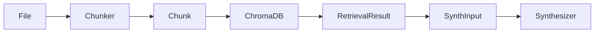
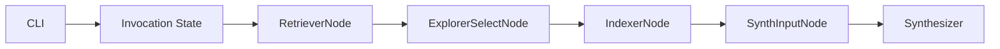

# Data Models

## Overview

This document describes all data models used in the ASKII system, including Pydantic models, dataclasses, and internal data structures.

## Pydantic Models

### Chunk

**Location**: `src/chunking/models.py`

**Class**: `Chunk(BaseModel)`

**Description**: Represents a code chunk with metadata for storage in ChromaDB and retrieval.

**Fields**:

| Field | Type | Description | Required |
|-------|------|-------------|----------|
| `text` | `str` | The actual code/text content | Yes |
| `file_path` | `str` | Relative path from repo root | Yes |
| `line_range` | `str` | start_line-end_line (e.g., '45-67') | Yes |
| `symbol_name` | `Optional[str]` | Function or class name (for AST chunks) | No |
| `symbol_type` | `Optional[str]` | 'function' | 'class' | None | No |
| `token_count` | `int` | Number of tokens in chunk | Yes (default: 0) |
| `chunk_id` | `str` | Unique identifier for ChromaDB | Yes (default: "") |

**Example**:
```python
from src.chunking.models import Chunk

chunk = Chunk(
    text="def calculate_average(numbers: list[float]) -> float:\n    return sum(numbers) / len(numbers)",
    file_path="src/utils/math.py",
    line_range="45-47",
    symbol_name="calculate_average",
    symbol_type="function",
    token_count=15,
    chunk_id="src/utils/math.py:45-47"
)
```

**Usage**:
- Created by chunking strategies (AST chunker, sliding window)
- Stored in ChromaDB with metadata
- Retrieved and used by RetrieverNode
- Formatted by SynthInputNode for Synthesizer

**ChromaDB Storage**:
- `document`: `chunk.text`
- `id`: `chunk.chunk_id`
- `metadata`: `{file_path, line_range, symbol_name, symbol_type, token_count}`

### RetrievalResult

**Location**: `src/chunking/models.py`

**Class**: `RetrievalResult(BaseModel)`

**Description**: Result from retrieval operation, including chunks, similarity scores, and metrics.

**Fields**:

| Field | Type | Description | Required |
|-------|------|-------------|----------|
| `chunks` | `List[Chunk]` | List of retrieved chunks | Yes |
| `max_similarity` | `float` | Maximum similarity score (1 - distance) | Yes |
| `num_chunks_above_threshold` | `int` | Number of chunks above similarity threshold | Yes |
| `distances` | `List[float]` | Distance scores for each chunk (lower is more similar) | Yes |

**Example**:
```python
from src.chunking.models import RetrievalResult

result = RetrievalResult(
    chunks=[chunk1, chunk2, chunk3],
    max_similarity=0.85,
    num_chunks_above_threshold=2,
    distances=[0.15, 0.20, 0.35]
)
```

**Usage**:
- Created by `_retrieve_chunks()` in RetrieverNode
- Stored in `invocation_state["retrieval_result"]`
- Used by RetrieverNode for gating decision
- Used by SynthInputNode for formatting

**Similarity Calculation**:
- `similarity = 1 - distance` (clamped to [0, 1])
- `max_similarity`: Maximum similarity across all chunks
- Threshold: 0.7 for strong evidence

### RepoInfo

**Location**: `src/utils/git_utils.py`

**Class**: `RepoInfo(BaseModel)`

**Description**: Repository information for routing and collection naming.

**Fields**:

| Field | Type | Description | Required |
|-------|------|-------------|----------|
| `path` | `str` | Repository path | Yes |
| `name` | `str` | Repository name | Yes |
| `collection_name` | `str` | Normalized collection name | Yes |

**Example**:
```python
from src.utils.git_utils import RepoInfo

repo_info = RepoInfo(
    path="/Users/roygal/Projects/ASKII",
    name="ASKII",
    collection_name="Users_roygal_Projects_ASKII"
)
```

**Usage**:
- Created by `get_repo_info()` in git_utils
- Used by CLI for collection naming
- Passed through graph invocation state

**Collection Name Generation**:
- Normalizes absolute path
- Replaces path separators with underscores
- Removes leading/trailing underscores
- Collapses multiple underscores

### FilesResponse

**Location**: `src/agents/factories/explorer.py`

**Class**: `FilesResponse(BaseModel)`

**Description**: Structured output from Explorer agent containing selected file paths.

**Fields**:

| Field | Type | Description | Required |
|-------|------|-------------|----------|
| `files` | `list[str]` | Absolute file paths | Yes |

**Example**:
```python
from src.agents.factories.explorer import FilesResponse

response = FilesResponse(
    files=[
        "/path/to/repo/src/main.py",
        "/path/to/repo/src/utils/helpers.py"
    ]
)
```

**Usage**:
- Structured output model for Explorer agent
- Extracted by ExplorerSelectNode
- Passed to IndexerNode for indexing

## Dataclasses

### IndexingRun

**Location**: `src/agents/nodes/indexer.py`

**Class**: `IndexingRun(dataclass)`

**Description**: Statistics and results from an indexing operation.

**Fields**:

| Field | Type | Description |
|-------|------|-------------|
| `requested_abs` | `list[str]` | Absolute paths requested for indexing |
| `indexed_abs` | `list[str]` | Absolute paths successfully indexed |
| `indexed_rel` | `list[str]` | Relative paths successfully indexed |
| `skipped_abs` | `list[str]` | Absolute paths skipped (invalid, outside repo, already indexed) |
| `errors` | `list[str]` | Error messages for failed indexing attempts |

**Example**:
```python
from src.agents.nodes.indexer import IndexingRun

run = IndexingRun(
    requested_abs=["/path/to/file1.py", "/path/to/file2.py"],
    indexed_abs=["/path/to/file1.py"],
    indexed_rel=["file1.py"],
    skipped_abs=["/path/to/file2.py"],
    errors=["Failed to index /path/to/file2.py: Permission denied"]
)
```

**Usage**:
- Created by `_run_indexing()` in IndexerNode
- Used for logging and state tracking
- Stored in node result state

## Internal Data Structures

### Invocation State

**Type**: `dict[str, Any]`

**Description**: Shared state dictionary passed through graph execution.

**Common Keys**:

| Key | Type | Description | Set By |
|-----|------|-------------|---------|
| `repo_path` | `str` | Absolute repository path | CLI |
| `repo_name` | `str` | Repository name | CLI |
| `collection` | `Collection` | ChromaDB collection | CLI |
| `question` | `str` | User question | CLI |
| `attempts` | `int` | Current loop attempt count | RetrieverNode |
| `already_indexed` | `set[str]` | Set of already-indexed relative paths | IndexerNode |
| `retrieval_result` | `RetrievalResult` | Latest retrieval results | RetrieverNode |
| `should_synthesize` | `bool` | Whether to synthesize or continue loop | RetrieverNode |
| `explorer_files_abs` | `list[str]` | Absolute file paths from Explorer | ExplorerSelectNode |
| `synth_task` | `str` | Formatted task for Synthesizer | SynthInputNode |

**Usage**:
- Passed to all nodes via `invoke_async(invocation_state=...)`
- Modified by nodes to pass data downstream
- Read by nodes to access upstream data

### Node Result State

**Type**: `dict[str, Any]` (stored in `AgentResult.state`)

**Description**: Node-specific state stored in AgentResult.

**RetrieverNode State**:
- `approved: bool`: Whether to synthesize
- `should_synthesize: bool`: Same as approved
- `attempts: int`: Current attempt count
- `max_attempts: int`: Maximum attempts (3)
- `max_similarity: float`: Maximum similarity score

**IndexerNode State**:
- `requested: int`: Number of files requested
- `indexed: int`: Number of files indexed
- `skipped: int`: Number of files skipped
- `errors: list[str]`: Error messages

**ExplorerSelectNode State**:
- `selected: int`: Number of files selected

**SynthInputNode State**:
- `snippets: int`: Number of snippets
- `max_similarity: float`: Maximum similarity score

## Data Flow

### Chunk Lifecycle



1. **Creation**: File → Chunker → Chunk
2. **Storage**: Chunk → ChromaDB (with metadata)
3. **Retrieval**: ChromaDB → RetrievalResult
4. **Formatting**: RetrievalResult → SynthInput → Formatted task
5. **Usage**: Formatted task → Synthesizer → Answer

### State Flow



State flows through nodes, with each node reading from and writing to the shared invocation state dictionary.

## Validation

### Pydantic Validation

All Pydantic models automatically validate:
- Type checking
- Required fields
- Field constraints (if any)

### Custom Validation

**Chunk Validation**:
- `token_count` must be non-negative
- `chunk_id` should match `{file_path}:{line_range}` format
- `line_range` should match `{start}-{end}` format

**RetrievalResult Validation**:
- `max_similarity` should be in [0, 1]
- `distances` length should match `chunks` length
- `num_chunks_above_threshold` should be <= `chunks` length

**RepoInfo Validation**:
- `path` must exist and be a directory
- `path` must be a valid git repository
- `collection_name` must be non-empty

## Serialization

### ChromaDB Serialization

**Chunk → ChromaDB**:
- `document`: `chunk.text`
- `id`: `chunk.chunk_id`
- `metadata`: `{file_path, line_range, symbol_name, symbol_type, token_count}`

**ChromaDB → Chunk**:
- Reconstruct Chunk from ChromaDB query results
- Parse metadata back to Chunk fields

### JSON Serialization

Pydantic models support JSON serialization:
```python
chunk_dict = chunk.model_dump()
chunk_json = chunk.model_dump_json()
```

## Constants

### Chunking Constants

- **Max tokens per chunk**: 300
- **Sliding window overlap**: 20% (60 tokens)
- **Token encoding**: `cl100k_base`

### Retrieval Constants

- **Default top-k**: 10 chunks
- **Similarity threshold**: 0.7
- **Strong threshold**: 0.7
- **Max attempts**: 3

### Model Constants

- **Embedding model**: `gemini-embedding-001`
- **LLM model**: `gemini-2.5-flash`
- **Synthesizer temperature**: 0.7
- **Explorer temperature**: 0.1
- **Synthesizer max output tokens**: 8192

