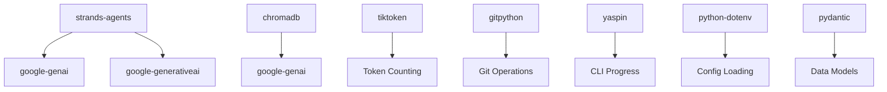

# Dependencies

## Overview

This document describes all external dependencies used in the ASKII system, their purposes, and usage patterns.

## Core Dependencies

### strands-agents[gemini]

**Version**: Latest (from requirements.txt)

**Purpose**: Agent framework with Gemini provider support

**Usage**:
- Graph orchestration (`GraphBuilder`, `MultiAgentBase`)
- Agent creation (`Agent` class)
- Model configuration (`GeminiModel`)
- Graph execution and streaming

**Key Imports**:
```python
from strands.multiagent import GraphBuilder
from strands.multiagent.base import MultiAgentBase
from strands.models.gemini import GeminiModel
from strands import Agent
```

**Location in Codebase**:
- `src/agents/graphs/rag_loop.py`: Graph building
- `src/agents/nodes/*.py`: Node implementations
- `src/agents/factories/*.py`: Agent factories

### strands-agents-tools

**Version**: Latest (from requirements.txt)

**Purpose**: Tool integrations for Strands agents

**Usage**:
- Shell tool for Explorer agent (ripgrep access)
- Tool execution and consent bypass

**Key Imports**:
```python
from strands_tools import shell
```

**Location in Codebase**:
- `src/agents/factories/explorer.py`: Shell tool for file search

### chromadb

**Version**: Latest (from requirements.txt)

**Purpose**: Vector database for storing embeddings and chunks

**Usage**:
- Persistent client for local storage
- Collection management (create, get, delete)
- Query operations (semantic search)
- Upsert operations (add chunks)

**Key Imports**:
```python
import chromadb
import chromadb.utils.embedding_functions as embedding_functions
```

**Location in Codebase**:
- `src/db/chroma.py`: Client initialization
- `src/cli/main.py`: Collection creation
- `src/agents/nodes/retriever.py`: Query operations
- `src/agents/nodes/indexer.py`: Upsert operations

**Storage**: `.data/chroma/` (relative to current working directory)

### google-genai

**Version**: Latest (from requirements.txt)

**Purpose**: Google Generative AI SDK

**Usage**:
- Embedding function for ChromaDB
- LLM model configuration

**Key Imports**:
```python
import chromadb.utils.embedding_functions as embedding_functions

embedding_function = embedding_functions.GoogleGenerativeAiEmbeddingFunction(
    api_key=os.getenv("GEMINI_API_KEY")
)
```

**Location in Codebase**:
- `src/cli/main.py`: Embedding function creation

### google-generativeai

**Version**: Latest (from requirements.txt)

**Purpose**: Google Generative AI client library

**Usage**:
- Direct API access (if needed)
- Model configuration

**Location in Codebase**:
- Used indirectly through strands-agents and chromadb

### tiktoken

**Version**: Latest (from requirements.txt)

**Purpose**: Token counting utilities

**Usage**:
- Count tokens in text
- Validate chunk sizes
- Encode/decode tokens for sliding window chunking

**Key Imports**:
```python
import tiktoken
```

**Location in Codebase**:
- `src/chunking/token_counter.py`: Token counting
- `src/chunking/sliding_window.py`: Token encoding/decoding
- `src/chunking/ast_chunker.py`: Token validation

**Encoding**: `cl100k_base` (GPT-4, GPT-3.5-turbo compatible)

### gitpython

**Version**: Latest (from requirements.txt)

**Purpose**: Git repository operations

**Usage**:
- Detect git repositories
- Extract repository information
- Validate repository paths

**Key Imports**:
```python
from git import Repo, InvalidGitRepositoryError
```

**Location in Codebase**:
- `src/utils/git_utils.py`: Repository operations

### yaspin

**Version**: Latest (from requirements.txt)

**Purpose**: Spinner animations for CLI

**Usage**:
- Display progress spinner during graph execution
- Update spinner text based on current node

**Key Imports**:
```python
from yaspin import yaspin
from yaspin.core import Yaspin
```

**Location in Codebase**:
- `src/cli/progress.py`: Spinner UI management
- `src/cli/main.py`: Spinner usage during graph execution

### python-dotenv

**Version**: Latest (from requirements.txt)

**Purpose**: Environment variable management

**Usage**:
- Load environment variables from `.env` file
- Fall back to system environment variables

**Key Imports**:
```python
from dotenv import load_dotenv
```

**Location in Codebase**:
- `app.py`: Environment loading at startup

### pydantic

**Version**: Latest (from requirements.txt)

**Purpose**: Data validation and models

**Usage**:
- Define data models (Chunk, RetrievalResult, RepoInfo, FilesResponse)
- Validate data structures
- Type checking

**Key Imports**:
```python
from pydantic import BaseModel, Field
```

**Location in Codebase**:
- `src/chunking/models.py`: Chunk and RetrievalResult models
- `src/utils/git_utils.py`: RepoInfo model
- `src/agents/factories/explorer.py`: FilesResponse model

### pathspec

**Version**: Latest (from requirements.txt)

**Purpose**: `.gitignore` pattern matching

**Usage**:
- Match file paths against `.gitignore` patterns
- Filter files during indexing (if implemented)

**Location in Codebase**:
- Listed in requirements but not actively used in current codebase
- Reserved for future `.gitignore` filtering

## Development Dependencies

### pytest

**Version**: >=7.0.0 (from requirements.txt)

**Purpose**: Testing framework

**Usage**:
- Run unit and integration tests
- Test discovery and execution

**Location in Codebase**:
- `tests/`: Test files

### pytest-mock

**Version**: >=3.10.0 (from requirements.txt)

**Purpose**: Mocking utilities for tests

**Usage**:
- Mock external dependencies (API calls, ChromaDB)
- Isolate units under test

**Location in Codebase**:
- `tests/`: Test files using mocks

## Dependency Relationships



## Dependency Management

### Installation

```bash
pip install -r requirements.txt
```

### Virtual Environment

Recommended to use a virtual environment:

```bash
python -m venv venv
source venv/bin/activate  # On Windows: venv\Scripts\activate
pip install -r requirements.txt
```

### Version Pinning

Current approach: Latest versions (no explicit version pinning in requirements.txt)

**Recommendation**: Consider pinning versions for production use:
```
strands-agents[gemini]==x.y.z
chromadb==x.y.z
tiktoken==x.y.z
# etc.
```

## API Key Dependencies

### Google Gemini API

**Required**: `GEMINI_API_KEY` or `GOOGLE_API_KEY`

**Usage**:
- Embedding generation (via ChromaDB embedding function)
- LLM inference (via Strands GeminiModel)

**Configuration**:
- Set in environment variables or `.env` file
- Loaded at application startup

## Platform Dependencies

### Python Version

**Required**: Python 3.8+

**Reason**: AST `end_lineno` attribute (Python 3.8+)

### System Tools

**ripgrep (`rg`)**:
- Required for Explorer agent
- Used via Strands shell tool
- Must be installed and available in PATH

## Optional Dependencies

### Development Tools

- **pytest**: Testing (development only)
- **pytest-mock**: Mocking (development only)

## Dependency Updates

### Update Strategy

1. **Regular Updates**: Update dependencies regularly for security and features
2. **Testing**: Run tests after dependency updates
3. **Version Compatibility**: Verify compatibility between related packages

### Known Compatibility

- **strands-agents** and **google-genai**: Must be compatible versions
- **chromadb** and **embedding functions**: Must support custom embedding functions
- **tiktoken** encoding: `cl100k_base` must be available

## Security Considerations

### API Keys

- Never commit API keys to version control
- Use environment variables or `.env` files (gitignored)
- Rotate keys regularly

### Dependency Vulnerabilities

- Regularly audit dependencies for security vulnerabilities
- Use tools like `pip-audit` or `safety`
- Update vulnerable dependencies promptly

## Future Dependencies

### Potential Additions

- **tqdm**: Progress bars for long-running operations (currently using yaspin for spinners)
- **rich**: Enhanced CLI output formatting
- **pydantic-settings**: Advanced configuration management
- **httpx**: HTTP client for API calls (if direct API access needed)

## Dependency Size

### Large Dependencies

- **chromadb**: Includes vector database engine
- **strands-agents**: Includes agent framework and model integrations
- **google-generativeai**: Includes API client libraries

### Lightweight Dependencies

- **tiktoken**: Token counting only
- **yaspin**: Spinner UI only
- **python-dotenv**: Environment variable loading only
- **pydantic**: Data validation only

## License Compatibility

All dependencies should be compatible with the project's license (to be determined). Verify licenses before adding new dependencies.

