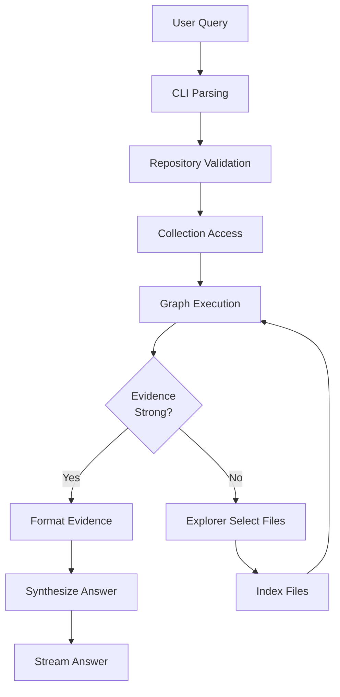
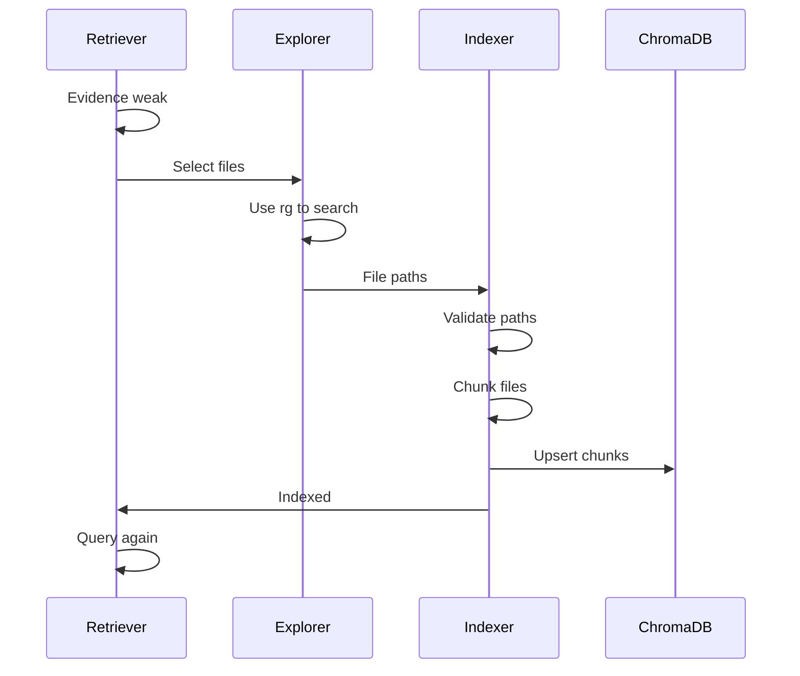
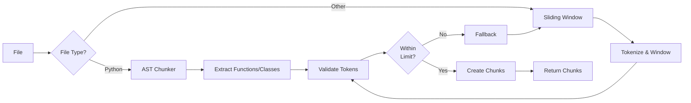
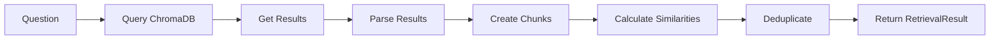
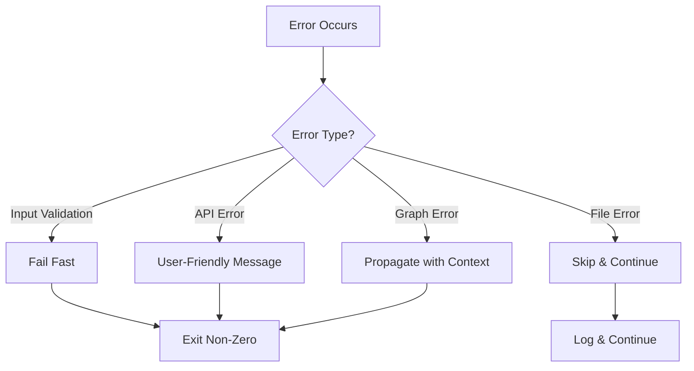
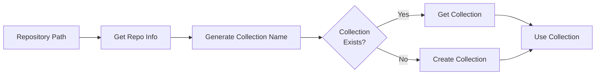
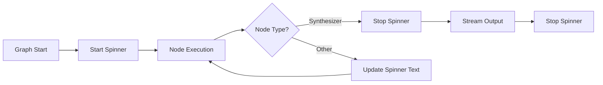
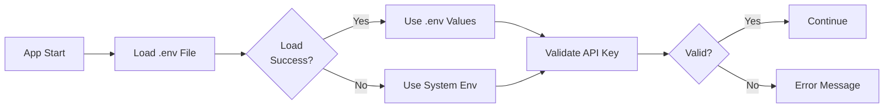
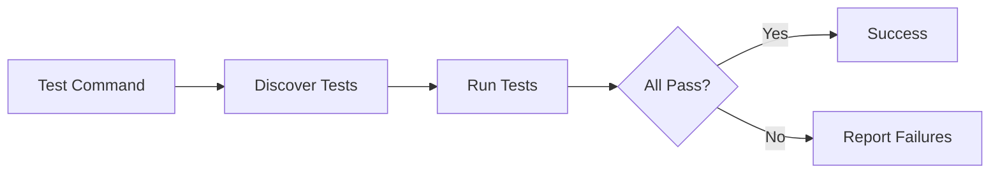

# Workflows

## Overview

This document describes the key workflows and processes in the ASKII system, from user query to final answer.

## Main Workflow: Query Execution

### High-Level Flow



### Detailed Steps

1. **CLI Parsing** (`src/cli/main.py`)
   - Parse command-line arguments
   - Extract question and repository path
   - Validate question is not empty

2. **Repository Validation** (`src/utils/git_utils.py`)
   - Validate repository path exists
   - Verify it's a git repository
   - Extract repository information (name, collection name)

3. **Collection Access** (`src/db/chroma.py`)
   - Get or create ChromaDB collection
   - Configure embedding function (Gemini)
   - Set collection metadata (cosine similarity)

4. **Graph Execution** (`src/agents/graphs/rag_loop.py`)
   - Build RAG loop graph
   - Initialize invocation state
   - Execute graph with streaming

5. **Retrieval** (`src/agents/nodes/retriever.py`)
   - Query ChromaDB with semantic search
   - Post-process results (deduplication)
   - Calculate evidence strength
   - Gate loop based on evidence

6. **Conditional Branching**
   - **If evidence strong**: Proceed to synthesis
   - **If evidence weak**: Trigger indexing loop

7. **Indexing Loop** (if needed)
   - Explorer selects files
   - Indexer chunks and indexes files
   - Loop back to retrieval

8. **Synthesis** (if evidence strong)
   - Format evidence for Synthesizer
   - Generate answer with citations
   - Stream answer to stdout

## Targeted Indexing Workflow

### Purpose

When evidence is weak, the system uses targeted indexing to improve retrieval quality by indexing only relevant files.

### Flow



### Steps

1. **Evidence Assessment** (`RetrieverNode`)
   - Query ChromaDB
   - Calculate max similarity
   - Determine if evidence is strong (>= 0.7) or weak (< 0.7)
   - Check attempt count (max 3 attempts)

2. **File Selection** (`ExplorerSelectNode` → `Explorer Agent`)
   - Invoke Explorer agent with question
   - Agent uses ripgrep (`rg`) to find relevant files
   - Returns structured output: list of absolute file paths
   - Extract paths and store in invocation state

3. **File Indexing** (`IndexerNode`)
   - Validate file paths (ensure within repository)
   - Check if files already indexed
   - Chunk files using appropriate strategy
   - Delete old chunks for files (re-indexing)
   - Upsert new chunks to ChromaDB
   - Update already-indexed set

4. **Retry Retrieval** (`RetrieverNode`)
   - Query ChromaDB again with same question
   - Reassess evidence strength
   - Continue loop or proceed to synthesis

## Chunking Workflow

### Purpose

Split files into semantically meaningful chunks for storage and retrieval.

### Flow



### Steps

1. **File Routing** (`src/chunking/chunker.py`)
   - Determine file extension
   - Route to AST chunker (`.py`) or sliding window (others)

2. **AST Chunking** (`src/chunking/ast_chunker.py`)
   - Parse Python file with `ast` module
   - Extract function and class definitions
   - Include decorators
   - Preserve precise line ranges
   - Validate token count (300 limit)
   - Fall back to sliding window if too large

3. **Sliding Window Chunking** (`src/chunking/sliding_window.py`)
   - Tokenize entire file
   - Create overlapping windows (300 tokens, 20% overlap)
   - Estimate line ranges from character positions
   - Handle edge cases (empty files, small files)

4. **Chunk Creation**
   - Create Chunk objects with metadata
   - Generate chunk IDs (`{file_path}:{line_range}`)
   - Count tokens
   - Extract symbol information (for AST chunks)

## Retrieval Workflow

### Purpose

Retrieve relevant code chunks from ChromaDB using semantic similarity search.

### Flow



### Steps

1. **Query ChromaDB** (`src/agents/nodes/retriever.py`)
   - Query collection with question text
   - Request top-k results (default: 10)
   - Get documents, metadata, distances

2. **Parse Results**
   - Extract IDs, documents, metadatas, distances
   - Handle empty results

3. **Create Chunks**
   - Reconstruct Chunk objects from ChromaDB results
   - Parse metadata (file_path, line_range, symbol_name, etc.)

4. **Calculate Similarities**
   - Convert distances to similarities: `similarity = 1 - distance`
   - Clamp to [0, 1]
   - Calculate max similarity

5. **Deduplication**
   - Remove overlapping chunks (same file, overlapping line ranges)
   - Keep chunks with highest similarity when overlapping

6. **Return Results**
   - Create RetrievalResult with chunks, similarities, metrics
   - Store in invocation state

## Synthesis Workflow

### Purpose

Generate a natural language answer from retrieved code chunks with inline citations.

### Flow


### Steps

1. **Format Task** (`src/agents/nodes/synth_input.py`)
   - Extract question from invocation state
   - Extract RetrievalResult from invocation state
   - Build formatted task string

2. **Task Structure**
   - User question
   - Evidence summary (chunk count, max similarity)
   - Retrieved snippets with citations
   - Citation format: `[file_path:line_range]`

3. **Synthesizer Execution** (`src/agents/factories/synthesizer.py`)
   - Invoke Synthesizer agent with formatted task
   - Agent generates answer using only provided snippets
   - Includes inline citations for every claim

4. **Streaming Output** (`src/cli/main.py`)
   - Stream Synthesizer output directly to stdout
   - Stop spinner when streaming starts
   - Print newline after completion

## Error Handling Workflow

### Purpose

Handle errors gracefully throughout the system with user-friendly messages.

### Flow



### Error Categories

1. **Input Validation Errors**
   - Invalid repository path
   - Empty question
   - Non-git repository
   - **Handling**: Fail fast with clear error message, exit non-zero

2. **File Errors**
   - File read errors
   - Permission denied
   - Invalid file paths
   - **Handling**: Skip file, log error, continue processing (best-effort)

3. **API Errors**
   - Missing API key
   - Invalid API key
   - Rate limiting
   - **Handling**: User-friendly error message, exit non-zero

4. **Graph Errors**
   - Node execution failures
   - Structured output mismatches
   - **Handling**: Propagate with context, exit non-zero

## Collection Management Workflow

### Purpose

Manage ChromaDB collections for different repositories.

### Flow



### Steps

1. **Repository Identification** (`src/utils/git_utils.py`)
   - Get repository information
   - Generate normalized collection name from absolute path

2. **Collection Access** (`src/db/chroma.py`)
   - Check if collection exists
   - Get existing collection or create new one
   - Configure embedding function (Gemini)
   - Set metadata (cosine similarity)

3. **Collection Usage**
   - Pass collection through graph invocation state
   - Nodes use collection for query/upsert operations

## Progress Indication Workflow

### Purpose

Provide visual feedback during graph execution.

### Flow



### Steps

1. **Spinner Initialization** (`src/cli/progress.py`)
   - Start yaspin spinner with initial text
   - Get node action mappings

2. **Node Execution Updates**
   - Listen for `multiagent_node_start` events
   - Update spinner text based on node ID
   - Display human-friendly action labels

3. **Synthesizer Streaming**
   - Detect Synthesizer node stream events
   - Stop spinner when streaming starts
   - Stream output directly to stdout

4. **Cleanup**
   - Stop spinner on completion or error
   - Print newline after completion

## Configuration Workflow

### Purpose

Load and validate configuration from environment variables.

### Flow



### Steps

1. **Environment Loading** (`app.py`)
   - Try to load `.env` file with `python-dotenv`
   - Fall back to system environment variables if `.env` fails
   - Handle permission errors gracefully

2. **API Key Validation**
   - Check for `GEMINI_API_KEY` or `GOOGLE_API_KEY`
   - Validate key is present (actual validation happens at API call)

3. **Optional Configuration**
   - Load token limit overrides
   - Use defaults if not specified

## Testing Workflow

### Purpose

Run tests to verify system functionality.

### Flow



### Test Types

1. **Integration Tests** (`tests/test_graphs.py`)
   - Test full graph execution
   - Verify end-to-end workflows

2. **Error Handling Tests** (`tests/test_error_handling.py`)
   - Test error message formats
   - Verify error propagation

### Running Tests

```bash
# Run all tests
pytest

# Run specific test file
pytest tests/test_graphs.py

# Run with verbose output
pytest -v
```

