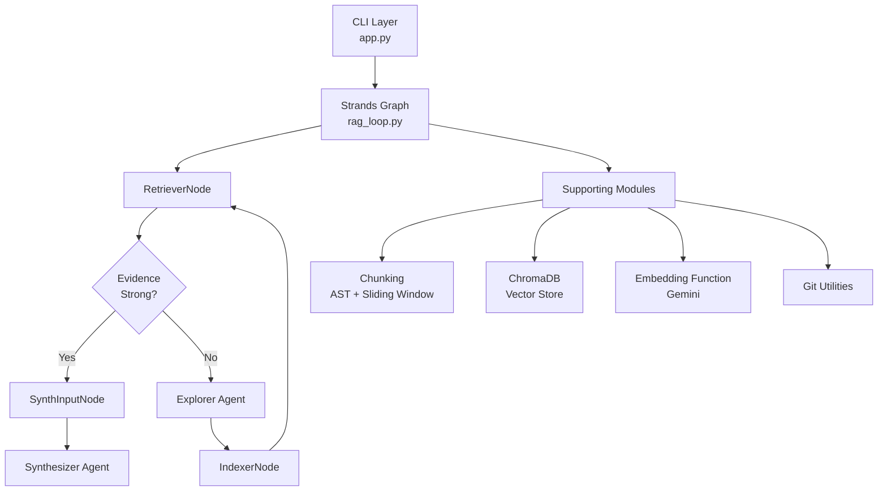
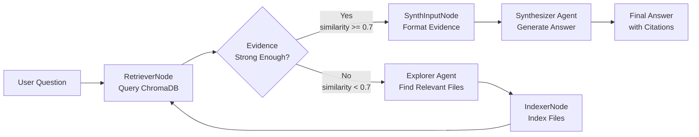
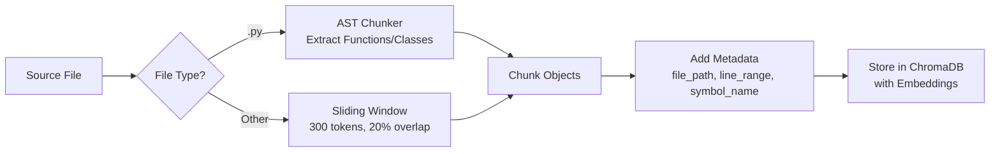
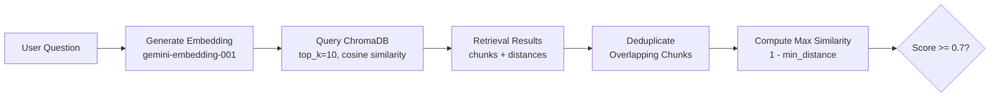

# ASKII Architecture

## Overview

ASKII is a RAG (Retrieval-Augmented Generation) system that enables natural language queries over codebases. It uses a **targeted indexing loop** architecture: retrieve evidence from ChromaDB, and if evidence is weak, use an Explorer agent to select relevant files to index, then retry retrieval.

## High-Level Architecture

## Agent Flow

The system uses a cyclic workflow that automatically improves evidence quality through targeted indexing:

### Flow Details

1. **RetrieverNode** queries ChromaDB using semantic similarity search
2. **Gating Decision**: If max similarity ≥ 0.7 and chunks found → proceed to synthesis
3. **Otherwise**: Explorer agent uses ripgrep to find relevant files
4. **IndexerNode** chunks and indexes Explorer-selected files into ChromaDB
5. **Loop**: Retriever queries again with updated index
6. **Synthesis**: When evidence is strong, SynthInputNode formats snippets and Synthesizer generates cited answer

## Component Overview

### Graph Nodes (Deterministic)

#### RetrieverNode
- **Location**: `src/agents/nodes/retriever.py`
- **Responsibility**: Query ChromaDB, compute evidence strength, gate the loop
- **Input**: Question, ChromaDB collection
- **Output**: RetrievalResult + approval decision
- **Key Logic**:
  - Queries top 10 chunks by similarity
  - Deduplicates overlapping chunks (same file, overlapping line ranges)
  - Approves if max_similarity ≥ 0.7 OR attempts ≥ 3

#### ExplorerSelectNode
- **Location**: `src/agents/nodes/explorer_select.py`
- **Responsibility**: Bridge between graph and Explorer agent
- **Input**: Question, already-indexed files (optional)
- **Output**: Absolute file paths from Explorer

#### IndexerNode
- **Location**: `src/agents/nodes/indexer.py`
- **Responsibility**: Chunk and index Explorer-selected files
- **Input**: Absolute file paths
- **Output**: Updated ChromaDB collection (side effect)
- **Key Logic**:
  - Deletes existing chunks for files before re-indexing
  - Uses AST chunking for Python files, sliding window for others
  - Skips files outside repository boundary
  - Best-effort: continues on errors

#### SynthInputNode
- **Location**: `src/agents/nodes/synth_input.py`
- **Responsibility**: Format retrieval evidence for Synthesizer
- **Input**: Question, RetrievalResult
- **Output**: Formatted task string with snippets and citations
- **Format**: Includes question, evidence stats, and code snippets with `[file_path:line_range]` citations

### Agents (LLM-Powered)

#### Explorer Agent
- **Location**: `src/agents/factories/explorer.py`
- **Model**: `gemini-2.5-flash` (temperature: 0.1)
- **Tools**: `shell` (for ripgrep access)
- **Input**: Question + optional already-indexed file list
- **Output**: `FilesResponse` (Pydantic model with `files: list[str]`)
- **Behavior**:
  - Uses `rg -l` to find file paths matching question patterns
  - Returns at most 10 absolute file paths
  - Never reads file contents directly (only uses ripgrep output)

#### Synthesizer Agent
- **Location**: `src/agents/factories/synthesizer.py`
- **Model**: `gemini-2.5-flash` (temperature: 0.7, max_output_tokens: 8192)
- **Input**: Formatted task string (question + snippets with citations)
- **Output**: Plain text answer with inline citations
- **Behavior**:
  - Enforces citation format: `[file.py:start-end]`
  - Refuses to answer if no snippets provided
  - Hedges explicitly when evidence is weak
  - Never suggests modifying the repository

## Design Choices

### Why Strands Graph?

- **Declarative orchestration**: Graph structure makes the cyclic loop explicit and easy to reason about
- **Conditional routing**: Built-in support for conditional edges based on node state
- **Agent integration**: Seamless integration between deterministic nodes and LLM agents
- **Execution control**: Built-in limits (max node executions, timeout) prevent infinite loops

### Why ChromaDB?

- **Local-first**: No external service dependencies, data stored in `.data/chroma/`
- **Persistent**: Index survives across CLI invocations
- **Embedding function support**: Easy integration with custom embedding functions
- **Metadata filtering**: Supports rich metadata (file_path, line_range, symbol_name) for post-processing

### Why AST Chunking for Python?

- **Semantic boundaries**: Functions and classes are natural code units
- **Better retrieval**: Symbol names improve semantic search accuracy
- **Precise citations**: Exact line ranges for functions/classes
- **Token efficiency**: Respects 300-token limit while preserving logical units

### Why Sliding Window for Other Files?

- **Language-agnostic**: Works for any text-based file (configs, docs, etc.)
- **Overlap**: 20% overlap (60 tokens) ensures context continuity
- **Fallback**: When AST parsing isn't available, sliding window provides reasonable chunking

### Why Targeted Indexing Loop?

- **Efficiency**: Only indexes files relevant to the question (not entire repo upfront)
- **Adaptive**: Improves evidence quality iteratively
- **Cost-effective**: Reduces API calls by indexing only what's needed
- **User experience**: Faster initial responses, better answers through iteration

## Data Flow

### Chunking Pipeline

### Retrieval Pipeline

## Key Thresholds and Parameters

### Retrieval
- **Top-k**: 10 chunks per query
- **Similarity threshold**: 0.7 (for strong evidence)
- **Strong evidence threshold**: 0.7 (max_similarity)
- **Max attempts**: 3 retrieval attempts before synthesizing

### Chunking
- **Max tokens per chunk**: 300
- **Sliding window overlap**: 20% (60 tokens)
- **Token encoding**: `cl100k_base` (tiktoken)

### Embeddings
- **Model**: `gemini-embedding-001`
- **Batch size**: 100 items per batch
- **Dimension**: 768 (handled by ChromaDB)

### LLM
- **Model**: `gemini-2.5-flash`
- **Temperature**: 0.7 (Synthesizer), 0.1 (Explorer)
- **Max output tokens**: 8192 (Synthesizer)
- **Streaming**: Yes (streams directly to stdout)

### Graph Execution
- **Max node executions**: 20
- **Execution timeout**: 300 seconds (5 minutes)
- **Reset on revisit**: Yes (nodes reset state when revisited)

## Storage

### ChromaDB Collections

- **Location**: `.data/chroma/` (relative to current working directory)
- **Collection naming**: Based on repository name and remote URL hash (see `src/utils/git_utils.py`)
- **Metadata**: Each chunk includes:
  - `file_path`: Relative path from repo root
  - `line_range`: Line range string (e.g., "45-67")
  - `symbol_name`: Function or class name (if applicable)
  - `symbol_type`: "function" or "class" (if applicable)
  - `token_count`: Number of tokens in chunk

### Index Management

- **Automatic**: Indexes files on-demand when Explorer selects them
- **Incremental**: Only indexes files not already indexed (tracked in `already_indexed` set)
- **Re-indexing**: Deletes old chunks before adding new ones for the same file
- **Reset**: Use `--reset-index` flag to delete collection and start fresh

## Error Handling

### Graceful Degradation

- **Bad files**: Skipped during indexing, processing continues
- **API errors**: Retry logic with exponential backoff (see `src/utils/retry.py`)
- **Empty collections**: Returns empty RetrievalResult, triggers Explorer
- **Weak evidence**: Loops to Explorer/Indexer instead of failing

### User Messaging

- **CLI errors**: User-friendly messages, exit non-zero
- **No evidence**: Synthesizer returns explicit "no relevant code found" message
- **Weak evidence**: Synthesizer hedges and states uncertainties

## Extension Points

### Adding a New Chunking Strategy

1. Create chunker function: `chunk_<type>_file(file_path, source, repo_path) -> List[Chunk]`
2. Update `src/chunking/chunker.py` to route to new strategy
3. Add tests in `tests/test_chunking.py`

### Adding a New Node

1. Create node class inheriting from `MultiAgentBase`
2. Implement `invoke_async()` method
3. Add node to graph in `src/agents/graphs/rag_loop.py`
4. Update `get_node_actions()` for progress UI

### Modifying Retrieval Logic

- Edit `src/agents/nodes/retriever.py`
- Adjust thresholds: `STRONG_THRESHOLD`, `SIMILARITY_THRESHOLD`, `MAX_ATTEMPTS`
- Modify gating logic in `invoke_async()`

## Performance Considerations

### Indexing

- **Lazy**: Only indexes files when needed (Explorer-selected)
- **Batch operations**: ChromaDB `add()` accepts multiple chunks at once
- **Deduplication**: Prevents redundant chunks in collection

### Retrieval

- **Top-k limiting**: Only retrieves top 10 chunks (configurable)
- **Deduplication**: Post-processing removes overlapping chunks
- **Caching**: ChromaDB handles embedding caching internally

### API Usage

- **Embedding batching**: Processes up to 100 texts per API call
- **Retry logic**: Handles transient API errors automatically
- **Rate limiting**: Exponential backoff with jitter prevents overwhelming API

## Security Considerations

### Read-Only Operations

- **No file modifications**: ASKII never writes to source repositories
- **Path validation**: IndexerNode ensures files are within repository boundary
- **Git-only**: Only processes git repositories (prevents accidental indexing of system files)

### API Key Management

- **Environment variables**: API keys stored in environment, not in code
- **Optional .env**: Supports `.env` file for local development
- **No hardcoding**: All API access uses environment variables

## Future Improvements

Potential enhancements (not currently implemented):

- **Multi-language AST support**: Extend AST chunking to other languages (TypeScript, Java, etc.)
- **Configurable thresholds**: Allow users to adjust similarity thresholds via CLI flags
- **Index persistence**: Share indexes across repositories with same remote URL
- **Incremental updates**: Track file changes and update index incrementally
- **Citation validation**: Verify citations point to actual code in repository

